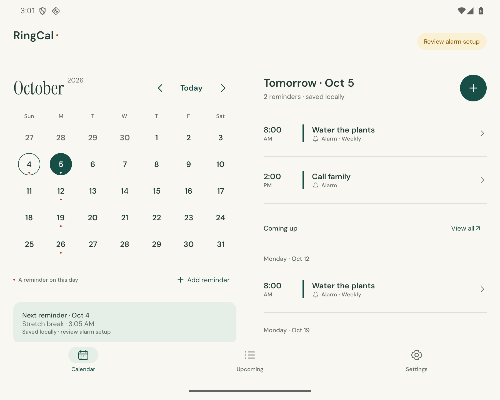
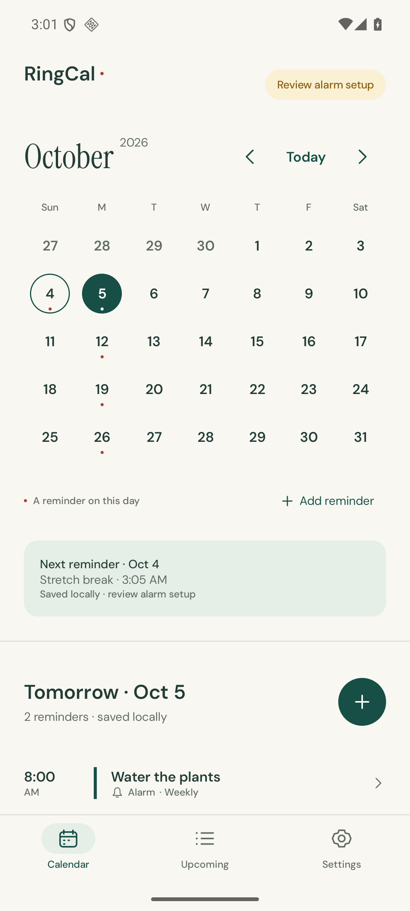
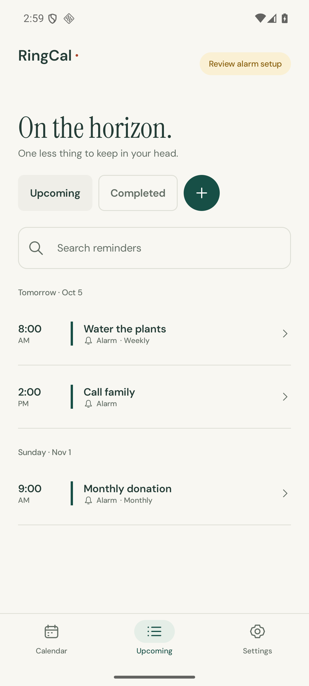
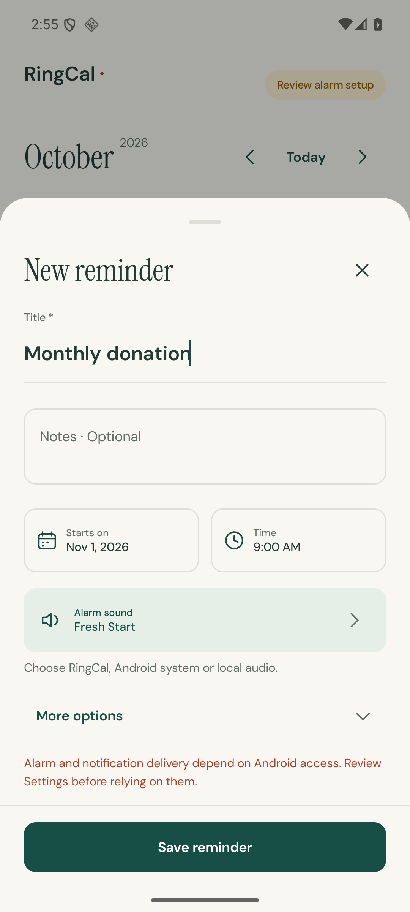
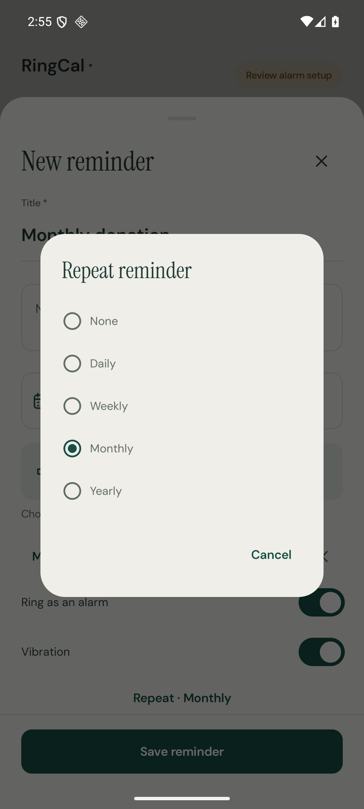
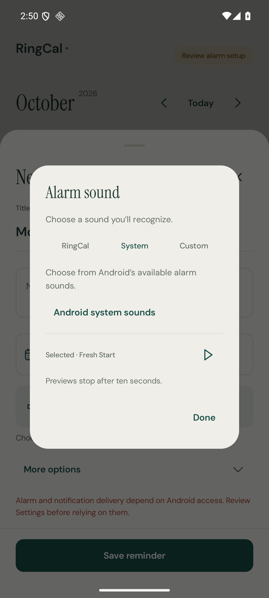
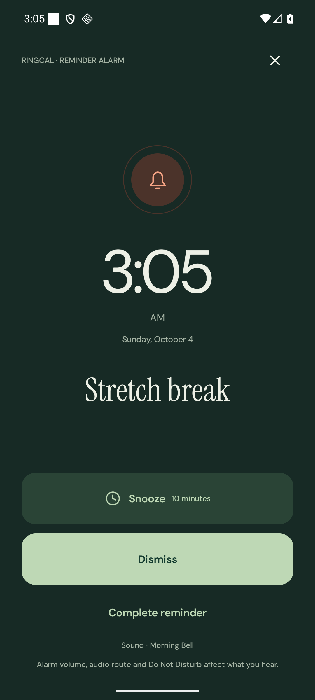
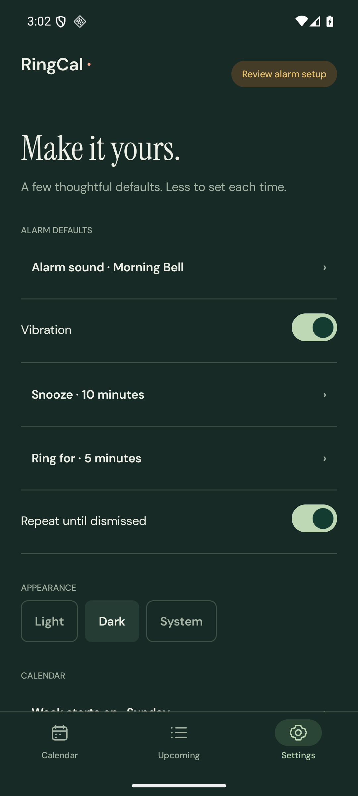

<div align="center">

# RingCal

### A calendar that rings. A little less to keep in your head.

A thoughtful Android calendar for the things you want to remember —
with real alarms, repeating tasks and room for your day.

**By Kamal Ahmed · Android 8.0+ · Works offline · No account, ads or analytics**

[**Download the latest beta**](https://github.com/kamalahmed/RingCal-Releases/releases/download/v0.9.0-beta.1/RingCal-0.9.0-beta.1.apk) · [Release notes](RELEASE-NOTES.md) · [All releases](https://github.com/kamalahmed/RingCal-Releases/releases)



</div>

## Why RingCal exists

Some things deserve more than a notification you can miss: calling family, watering
the plants, making a monthly donation, or simply doing something at the right time.
RingCal brings those intentions into a calendar. Pick a day, write what matters, and
choose whether it should ring or arrive quietly.

Your reminders live on your phone. You can set them, review them and hear alarms
without an internet connection. The interface keeps the date, the task and the next
action clear, from a narrow phone screen to a wide foldable display.

## A look inside

These are full, unedited screenshots of the released app. **All reminders shown are
examples created for this gallery.** Tap any image to view it at full size.

<table>
<tr>
<td align="center" width="33%" valign="top"><a href="screenshots/calendar-light.png"></a><br><b>Your day, in context</b></td>
<td align="center" width="33%" valign="top"><a href="screenshots/upcoming.png"></a><br><b>What comes next</b></td>
<td align="center" width="33%" valign="top"><a href="screenshots/reminder-form.png"></a><br><b>Set something worth remembering</b></td>
</tr>
<tr>
<td align="center" width="33%" valign="top"><a href="screenshots/repeat-choices.png"></a><br><b>Build a rhythm</b></td>
<td align="center" width="33%" valign="top"><a href="screenshots/sound-picker.png"></a><br><b>Choose how it sounds</b></td>
<td align="center" width="33%" valign="top"><a href="screenshots/ringing.png"></a><br><b>A real alarm when it matters</b></td>
</tr>
<tr>
<td align="center" width="33%" valign="top"><a href="screenshots/settings-dark.png"></a><br><b>Make it feel like yours</b></td>
<td colspan="2" width="67%" valign="middle">Light, Dark and System appearance. Native Android controls, readable type, large touch targets, and layouts that adapt to the space available.</td>
</tr>
</table>

## Features that fit everyday life

### Start with a date

Browse the month, return to Today, and see reminders for the selected day. Upcoming
groups future tasks by date so you can see what is approaching. New reminders use
your selected date and the current local time; saved reminders retain the time you
set. Add a title and optional notes, then adjust the sound and alarm options.

### Once, or again and again

Choose **Daily, Weekly, Monthly or Yearly** in More options. The start date anchors
the repeat. For a donation on the first of every month, select the first, choose
Monthly, and set your preferred time.

**Complete** finishes that occurrence and keeps the next one. **End repeating task**
ends the series after confirmation. Editing a repeating reminder changes its series
definition. Dates that do not exist are skipped: a task on the 31st skips a month
without a 31st, and February 29 skips non-leap years.

### Hear it your way

Choose a RingCal sound, one of Android's system alarm sounds, or a local audio file.
The selected sound has a visible name and selection state. Play, pause and resume
icons let you try it before saving; previews are bounded to ten seconds.

Set vibration, snooze length, ring duration and whether audio repeats until dismissed.
When an alarm rings, its task is prominent and **Snooze** and **Dismiss** are within
reach. Ringing is bounded by the saved duration. You can also switch off Ring as an
alarm for a quieter reminder notification.

### Know your phone's setup

**Settings → Alarm reliability** helps you review the Android access and settings
that affect alarms, notifications and presentation. RingCal restores future alarms
after relevant system events such as restart and first unlock, time changes and
compatible app updates. Expired reminders become **Missed** for review, rescheduling
or completion; recovery does not suddenly play old alarms.

Closing or swiping away the app normally does not remove its scheduled alarms.
Android force-stop, a powered-off phone, denied access, volume, Do Not Disturb and
device restrictions can still affect delivery. Setup checks describe the current
configuration; they cannot guarantee that every alarm will be heard.
[Read the beta's limitations](LIMITATIONS.md).

### A calmer calendar

Choose **Light, Dark or System** appearance, Sunday or Monday as the first weekday,
and 12-hour or 24-hour time. Save alarm defaults for new reminders. Existing
reminders keep their own options. The calendar and detail layout adapt to wider
screens, and the app supports larger system text.

### Local by default

No account, ads, analytics or cloud synchronization. Reminder content and preferences
stay on your device. Alarms and snooze work offline. Internet access is used for
GitHub update checks and downloads; reminder content is not sent with those checks.
There is no export or backup feature in this beta.
[Read the privacy details](PRIVACY.md).

## Install RingCal

1. Download **RingCal-0.9.0-beta.1.apk** using the button above or the
   [published release](https://github.com/kamalahmed/RingCal-Releases/releases/tag/v0.9.0-beta.1).
   GitHub's “Source code” archives contain distribution documents, not the app.
2. Open the APK from Downloads. If Android asks, allow **Install unknown apps**
   for the browser or file manager opening it, then approve installation. You can
   turn that source's installation permission off afterward.
3. Open RingCal and review **Settings → Alarm reliability**. Installation permission
   and alarm/notification access are separate Android settings.

This is **0.9.0-beta.1, version code 14**, for Android 8.0/API 26 and later. Physical
checks used a Galaxy Z Fold8 on Android 17 / One UI 9, including a normal update that
kept reminders, preferences and future alarm registrations. The owner accepted this
beta after checking its UI and hearing the timed alarm. Wider device compatibility
and fresh cover-screen/TalkBack observations for this exact beta remain unverified.

If Android blocks installation or reports a signature conflict, keep the installed
app and inspect the message. **Do not uninstall RingCal or clear its storage to
bypass a conflict.** Those actions remove local reminders. Device, region and
security policy can affect direct installation; developer verification has not
been established for RingCal. [Android installation guidance](https://developer.android.com/distribute/marketing-tools/alternative-distribution)
explains direct APK distribution.

## Updates that keep your reminders

RingCal checks for a beta update when it returns to the foreground, approximately
once per 24 hours. **Settings → Updates → Check for updates** checks immediately.
A newer version appears in Settings and as a dismissible offer when it is appropriate;
the offer waits during ringing and other focused interactions.

Tap **Download update** to open that version's APK in your browser. Download it, open
it and approve Android's update prompt. The app uses the same package and persistent
signing key, and compatible updates keep reminders and preferences. **Install over
the existing app; do not uninstall first.** Earlier builds without the updater need
this compatible APK once to receive future in-app update offers.

Update detection is automatic; APK download and installation require your action.
There are no silent installs or mandatory updates. A failed or offline check is
shown as a failure, rather than saying the app is current. Local reminders continue
to work without a network connection.

<details>
<summary><b>APK identity and verification</b></summary>

Package: `com.kamalahmed.ringcal`.

Each release includes the signed APK, an APK SHA-256 checksum and `release.json`.
The persistent signing certificate SHA-256 is:

```text
a7723751bd5136cc0efeb52d505cf0f844b5703ef908661eadc91820fb0d74df
```

Android checks signing compatibility when updating. Use this repository's release
assets. A checksum identifies file bytes; it is not independent publisher authentication.

</details>

## About this repository

This public repository contains the app's signed beta releases, screenshots,
installation information, update metadata and licence notices. Android source is
maintained separately. To report a problem, use
[Issues](https://github.com/kamalahmed/RingCal-Releases/issues) and include the app
version, Android version and steps to reproduce it. Keep personal reminders and
private screenshots out of public reports.

[Privacy](PRIVACY.md) · [Known limitations](LIMITATIONS.md) · [Release notes](RELEASE-NOTES.md) · [Third-party notices](THIRD-PARTY-NOTICES.md)
